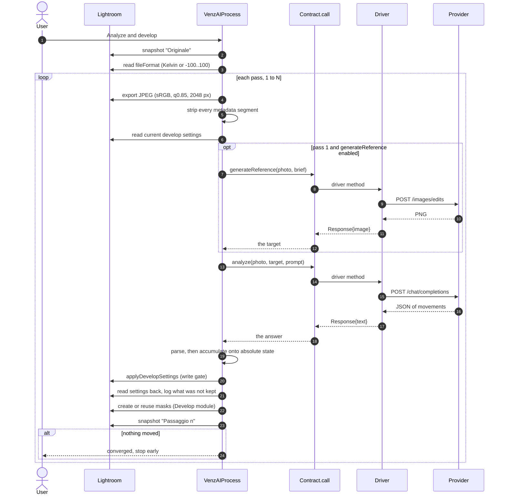

# Architecture

How VenzAI is put together, and why. For someone about to change it.

The README says what the plug-in does for a photographer. This file says where
the code lives, which module is allowed to know what, and which constraints
are not ours to choose.

---

## The one-sentence version

A photograph is exported, shown to a vision model together with an
AI-generated target image, and the model answers with a JSON object of slider
movements; the plug-in accumulates those movements onto what the photograph
already carries and writes the result into Lightroom, then does it again with
the result of its own edit.

---

## The shape of a run

`VenzAIProcess.lua` is both the menu entry and the engine — Lightroom runs the
file itself, so the whole run is one `LrTasks.startAsyncTask` at the top level.
Per pass, in order:

1. **Export** the photograph as a JPEG: sRGB, quality 0.85, longest side 2048.
   A vision model resizes an image to its own tiles before looking at it, so
   past a point more pixels cost upload time and tell the model nothing.
2. **Read the current develop settings** and format them for the prompt, so
   the model knows where every slider already stands.
3. **Generate the reference** — first pass only, and only if the active driver
   declares `generateReference` and its switch is on.
4. **Ask for the analysis**: one call, the same for every provider, carrying
   the photograph, the reference, and the prompt.
5. **Parse** the answer into develop settings and masks, discarding anything
   malformed rather than repairing it.
6. **Accumulate** the movements onto the running absolute state, clamping at
   the ends of each range.
7. **Write** the globals inside `catalog:withWriteAccessDo`, then read them
   straight back to see which ones Lightroom actually kept.
8. **Write the masks**, outside the catalog gate, because they go through a
   different API that needs the Develop module active.
9. **Snapshot**, so every pass is reachable from Lightroom's own history.

The loop stops early when a pass asks for nothing that would move the
photograph — see *Convergence* below.



Everything a driver touches is inside `Contract.call`. The engine's own
arrows never leave the machine, and the driver's never touch the catalog.

---

## The modules

| File | Owns | Must not know |
|---|---|---|
| `VenzAIProcess.lua` | The run: passes, exports, ordering, catalog writes, snapshots | Which provider is answering; how any provider's HTTP looks |
| `VenzAIPrompts.lua` | Every word sent to a model, and reading the current settings back into that vocabulary | How a request is transported |
| `VenzAIParse.lua` | The vocabulary: valid keys, ranges, mask types, and turning an answer into settings | What the settings will be used for |
| `VenzAIDelta.lua` | Movement semantics: what accumulates, what is a position, clamping, convergence | Lightroom, the catalog, any provider |
| `VenzAIMasks.lua` | Creating, finding and writing AI-selection masks through `LrDevelopController` | Prompts, providers, parsing |
| `VenzAIProviderContract.lua` | The shape every driver obeys, and the single funnel every call passes through | Any particular driver |
| `VenzAIProviderRegistry.lua` | Which drivers exist, validated once at load | How any of them work |
| `VenzAIProvider{Gemini,OpenAI,Ollama}.lua` | One service each: its URL, payload, headers, error shapes, settings fields | The engine, the prompts, each other |
| `VenzAISettings.lua` | Persistence, defaults, and where a secret goes | What any setting means |
| `PluginInfoProvider.lua` | The settings panel, built from what the drivers declare | Any provider by name |
| `VenzAIJpeg.lua` | Cutting the metadata out of the exported file before it is uploaded | Why the file is being uploaded |
| `VenzAIRunLock.lua` | One run at a time, and when a lock stops being believed | What a run does |
| `VenzAIWorkFolder.lua` | The working directory and its housekeeping | Everything else |
| `VenzAIJson.lua` | Escaping and the small amount of decoding we do | — |
| `VenzAILog.lua` | One log file, with a prefix per subsystem | — |
| `VenzAIMessages.lua` | Turning an error kind into something a photographer can read | — |
| `VenzAISelfTest.lua` | A menu entry that checks every driver without touching a photograph | — |

Two rules hold this together, and both are worth defending.

---

## Rule 1: the engine never names a provider

Adding a provider is one new file and one line in
`VenzAIProviderRegistry.lua`. Nothing else changes — not the engine, not the
settings panel, not the manifest.

A driver is a table declaring `id`, `displayName`, `capabilities`,
`settingsFields`, and one function per capability. Everything the rest of the
plug-in needs to know about it, it declares about itself.

**Capabilities** are a closed set — `analyze`, `generateReference`,
`listModels` — and a driver declares which it has. The engine asks
`Contract.capabilityEnabled(driver, capability, config)` rather than testing
for a provider by name: that function reads both the declaration and the
user's switch, so a capability can be shipped turned off.

**Every call goes through `Contract.call`**, which catches a raising driver,
validates what comes back, and guarantees the engine sees either a success
with the fields it expects or a failure with an error kind from a closed set
(`config_invalid`, `unreachable`, `auth`, `rate_limited`, `model_missing`,
`bad_request`, `server_error`, `empty`, `driver_fault`, `not_supported`,
`unknown`). The engine never sees an HTTP status, and a new driver cannot
invent a new way to fail.

**The settings panel is generated.** Each field declares a `key`, a `role`
(`secret`, `model`, `url`, `text`, `toggle`) and a localisation key. The role
decides both how the field is rendered and where it is stored — `secret` goes
to `LrPasswords`, everything else to `LrPrefs`. A `model` field gets a "Detect
models" button when the driver declares `listModels`.

**Drivers are validated once, at load.** `Contract.validateDriver` runs over
the registry's list, and a malformed driver is named precisely in the log and
in the self-test instead of failing obscurely halfway through a photograph.

---

## Rule 2: the model reports movements, not values

The model answers with **how far to move** each slider, not where to put it.
`VenzAIDelta.lua` owns what that means:

- The engine keeps a running absolute state, seeded from the photograph.
- Each pass, `Delta.apply` adds the movement and **clamps at the end of the
  range** — a movement that would overshoot is clamped, never discarded.
- Some keys are **positions, not movements**, and are taken as given:
  hues on a colour wheel (adding degrees needs wrap-around), the parametric
  split points (which must stay strictly increasing), mask strength, the
  vignette's shape, the grading blend, tone curves, enumerations, and the crop
  bounds (already relative, composed separately by the engine).
- A few sliders are not 0 on an untouched photograph; `Delta.NEUTRAL` holds
  those, so a movement applied to a photograph that reports nothing starts
  from the right place.

**Convergence.** Each key's outcome is recorded — `applied`, `clamped`,
`negligible`, `unchanged`, `absolute`, `implausible`, `unknown_scale` — and
`Delta.hasConverged` asks whether anything actually moved the photograph. A
movement smaller than 1% of its parameter's span counts as nothing. The run
stops when a pass asks for nothing, which is how three passes can finish in
two.

**Temperature is the awkward one.** Lightroom reports it in Kelvin for a raw
and on a −100..100 scale for a rendered file, and the scale decides both the
clamp and what counts as an implausible movement. It is read from the file
format, never inferred from the value: a raw still at "As Shot" reports no
Kelvin at all, and a movement of 18 written blind became an absolute 18 K.

---

## What Lightroom lets us do

Some of this design is not a choice.

**`LrDevelopController` is a remote control for a human's hands.** Most of its
functions require the Develop module to be the active module; the SDK's own
sample plug-ins are MIDI surface controllers. This is why masks are written
outside the catalog write gate, after the global settings, and why the run
leaves the Develop panel where it found it.

**No API positions a mask.** `createNewMask` accepts `brush`, `gradient`,
`radialGradient`, `rangeMask` and `aiSelection`, but nothing in the SDK can
place a brush stroke, a gradient or a circle. Only `aiSelection` is usable for
automation, because Lightroom computes the geometry itself. That is why the
six regions — `subject`, `people`, `objects`, `sky`, `landscape`,
`background` — are the whole local vocabulary.

**Mask creation is asynchronous and slow.** `VenzAIMasks.waitForNewMaskID`
polls for up to 45 seconds and identifies the new mask by diffing the mask IDs
present before and after the call, never by taking the last entry in the list —
that mistake once wrote one region's values onto another region's mask while
the log reported success.

**Applying settings is a request, not a command.** Lightroom silently overrides
some of what it is given, so every pass reads the settings back and
`Parse.settingsNotKept` reports the difference. A setting the model never
proposed and one Lightroom refused look identical in the photograph.

---

## Concurrency, and what is not guarded

**One photograph.** The engine calls `catalog:getTargetPhoto()`, so selecting
ten photographs and running the command develops the active one and ignores
the rest. There is no batch mode and no queue.

**One async task per invocation.** `VenzAIProcess.lua` is both the menu entry
and the engine: Lightroom loads and runs the file each time the command is
chosen, and the whole run is a single `LrTasks.startAsyncTask`. Inside it,
`LrTasks.sleep` and every yielding SDK call cooperate with Lightroom's own
scheduler, so the interface stays responsive and the progress scope can be
cancelled at six checkpoints. A run is never on a thread of its own: Lua in
Lightroom is single-threaded and cooperative.

**One run at a time, enforced.** Choosing the command while a run is in flight
is refused with a message saying how long the other run has been going. Two
runs would share the export path (`LR_collisionHandling = "overwrite"`), the
working folder, the log, and — the one that can spoil a photograph — the
Develop module and the *selected* mask, which is what
`LrDevelopController.setValue` writes into. It happened before the guard
existed: two runs nineteen seconds apart produced a log in which neither
reference image could be attributed with certainty.

`VenzAIRunLock.lua` holds it, and three decisions are worth knowing:

- **A file, not a variable.** Lightroom loads `VenzAIProcess.lua` afresh on
  every invocation, so a flag local to a module is not reliably the same flag.
  The lock is a file in the working folder holding the time the run began.
- **Released by a cleanup handler** on the run's `LrFunctionContext`, so it is
  released on a clean finish, on a cancel and on an error alike — not by code
  at the end of the function that an early `return` would skip.
- **It expires.** A guard that can wedge is worse than no guard, and the one
  exit a cleanup handler cannot cover is Lightroom being killed. A lock older
  than 30 minutes is taken over rather than obeyed — longer than any plausible
  run, since a measured three-pass run takes 4 minutes 20. A timestamp ahead of
  the clock, or a file whose contents do not parse, is not honoured either.
  Emptying the working folder from the settings panel removes it, which is the
  manual way out.

The decision itself is a pure function of two numbers, `RunLock.decide(heldSince,
now)`, so the cases that matter — stale, live, from the future, unreadable —
are tested without a filesystem or a clock.

Lightroom Classic runs one instance per machine — a second launch raises the
window that is already open — so the only concurrency that exists here is two
async tasks inside one Lua state, which is exactly what the lock separates.
That is also why `acquire` does not need to be atomic: nothing between its read
and its write yields, and there is no second process to race with.

**Still not guarded:** anything outside this plug-in moving the Develop panel
or changing the selected mask while a run is writing local corrections.

---

## Latency and what a run costs

A run is dominated by network time, and the plug-in makes no attempt to hide
that: the progress scope names the phase and the log timestamps every step.
Measured on a real run (OpenAI, gpt-5, three passes, 45 Mpx raw):

| Phase | Wall time |
|---|---|
| Export, strip, read settings | ~1 s per pass |
| Reference generation (pass 1 only) | **80 s** |
| Analysis call | 47 s, 50 s, 59 s |
| Write, masks, snapshot | 5–9 s per pass |
| **Total** | **4 min 20 s** |

### Every call is stateless, and that has a price

`Contract.call` has no session, no conversation and no server-side state: each
analysis is a fresh request carrying the photograph, the target and the whole
prompt. That is what makes the drivers interchangeable — a provider with no
conversation API is not a special case — and it is bought with bytes. From the
same run, as base64:

| Uploaded per pass | Size |
|---|---|
| The photograph, re-exported each pass | 260 KB, 278 KB, 230 KB |
| The reference image, **identical every pass** | 2,358 KB × 3 |
| The prompt | ~30 KB |

**Roughly 86% of everything uploaded is the same reference image, sent three
times.** It is a PNG returned by the image endpoint, and it is nine times the
size of the photograph it is a target for.

Three things follow, none of them yet done:

1. The reference could be downscaled before it is used. It comes back at
   1536×1024 and is judged only for tone and colour, which does not need
   1.7 MB of PNG.
2. Re-encoding it as JPEG would cost a fraction of that for a target whose
   fine detail is explicitly not measured.
3. A provider that supports prompt caching could keep the target across the
   passes of one run, which is exactly the shape of request caching is for.

The one optimisation that *is* in place is the export cap: 2048 px on the long
edge, because a vision model resizes an image to its own tiles before looking
at it, so past a point more pixels cost upload time and tokens without telling
the model anything. Dropping from 4096 to 2048 roughly quartered the bytes.

The other lever is in the photographer's hands and is documented as such: the
number of passes, 1 to 5. Each pass is one analysis call, and the loop stops
by itself when a pass asks for nothing — so a run that converges in two does
not pay for the third.

---

## What leaves this machine

The photograph is uploaded to a service the photographer does not control, so
it leaves with pixels and nothing else.

A JPEG exported from Lightroom carries the camera body and its serial number,
the lens, the date and time to the second, the GPS coordinates of where the
person stood, the artist and copyright fields, the keywords, the face regions
with people's names, and an XMP block including the catalog's own identifiers.
None of that helps a model judge exposure.

Two mechanisms, because one of them is a request:

1. The export settings ask Lightroom for the least metadata its own panel
   offers - `LR_embeddedMetadataOption`, `LR_removeLocationMetadata`,
   `LR_removeFaceMetadata`. A key a given Lightroom version does not know is
   ignored in silence, so this alone guarantees nothing.
2. `VenzAIJpeg.stripFile` then opens the exported file and cuts out every
   metadata segment - all of APP1 to APP15 and the comment segment - keeping
   only APP0 (the JFIF header) and APP2 (the ICC colour profile, whose removal
   would change the colours the model is asked to measure). The log names what
   it removed, so the claim is checkable after a run rather than asserted here.

**If the strip fails, the run stops.** A file whose contents we could not
verify is not uploaded. That is the one place in the engine where a failure is
not degraded gracefully, and deliberately so.

The reference image comes back from the model and never contains anything of
the photographer's; it is written to the working folder, which keeps its ten
most recent files and has a button that empties it.

---

## Prompts

`VenzAIPrompts.lua` holds every word sent to a model. Two things live there
that are easy to miss.

**There are two analysis prompts.** With a reference image the model is an
*instrument*: the edit already exists, the reference is the target, and every
step of the reasoning is a comparison. Without one there is nothing to measure
against, so the older *authorial* prompt is used, whole. Which one is built is
decided by `hasReference`, and both are pinned by tests.

**The prompt states the vocabulary the parser enforces.** `PARAM_RULES` lists
the keys and their ranges, and `VenzAIParse.VALID_KEYS` validates the same
set. One table, two readers; two tables would drift.

All prompts are in English, including in the Italian build: the models follow
technical instructions more reliably in English, and it is the language the
Lightroom settings format is documented in.

---

## Settings and storage

`VenzAISettings.lua` is the only module that touches `LrPrefs` and
`LrPasswords`. Both are keyed on `LrToolkitIdentifier`, so changing that
identifier in `Info.lua` orphans every saved setting and the stored API key.

A provider's configuration is assembled by `Settings.providerConfig(driverId,
settingsFields)`, which walks the driver's own declarations — so a field
nobody wrote yet comes back as its declared default, and two providers with
the same field name do not collide.

---

## Tests

The suite runs **outside Lightroom**, on a Lua 5.1 runtime driven from Python:

```bash
pip install -r tests/requirements.txt
python tests/run.py            # every suite
python tests/run.py delta      # only suites whose name matches
```

`tests/harness.lua` stubs `import` and `require` so the Lightroom SDK
namespaces resolve to fakes, and records the HTTP requests a driver makes.
Two suites are not about behaviour at all:

- `test_compiles.lua` loads every bundle file, which catches a syntax error
  before Lightroom does.
- `test_globals.lua` is a linter: it fails when a file calls a name nothing
  defines. An extracted function left behind as a bare global call has broken
  a real run twice.

---

## Traps that have cost us

Written down because each one was paid for.

- **A dot in a bound key is a key path.** `provider.gemini.apiKey` made LrView
  look for a nested table; every field rendered empty and nothing was saved.
  `Contract.bindingKey` produces flat names.
- **`pcall` cannot protect a yielding call.** In Lua 5.1 a C function may not
  yield, and a `pcall`-wrapped catalog read fails with "Yielding is not allowed
  within a C or metamethod call". Use `LrTasks.pcall`. This bug once silently
  disabled every refinement pass after the first.
- **Two tables are never `==` in Lua**, even holding the same numbers. Curves
  are compared element by element, in both the parser and the delta engine.
- **`pairs()` order is undefined.** Anything a model sees must be sorted, or a
  block whose lines shuffle between passes reads as a change that never
  happened.
- **Colour grading is stored under the legacy names.** Shadow and highlight
  hue and saturation are `SplitToning*`; writing the modern name writes
  nothing, silently. `Parse.toLightroomSettings` and `fromLightroomSettings`
  translate on the way out and back.
- **A bare name resolves at run time**, so a typo or a moved function is not a
  load error, it is a crash halfway through a photograph. Hence
  `test_globals.lua`.
